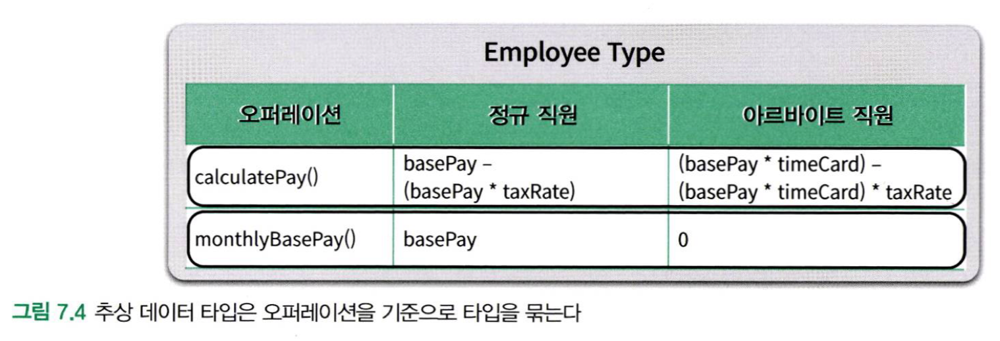
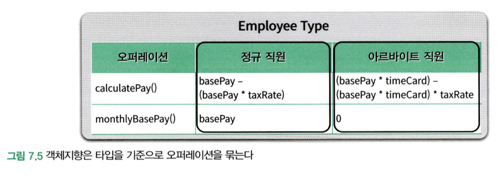

# 7장 객체 분해

사람의 기억은 단기 기억(STM)과 장기 기억(LTM)으로 분류할 수 있다.

- 장기 기억
  + 수개월에서 길게는 평생에 걸쳐 보관하는 저장소. 용량은 거의 무한대
  + 장기 기억 안에 보관돼 있는 지식은 직접 접근 불가. 단기 기억 영역으로 옮긴 후 처리.
- 단기 기억
  + 지식에 직접 접근 가능.
  + 정보를 보관할 수 있는 속도와 공간적인 측면에서 모두 제약
  + 공간적 측면의 제약
    - 매직넘버 7(7+-2 규칙)
  + 속도 측면의 제약
    - 5초 정도의 시간이 소요
  + 사람은 단기 기억에 있어 두가지 측면 모두가 병목 지점으로 작용

실제로 문제를 해결하기 위해 사용하는 저장소는 단기 기억이며, 단기 기억의 용량을 초과하는 순간 문제 해결 능력은 급격하게 떨어지고 이러한 현상을 **인지 과부하**라고 부른다.

- 추상화
  + 인지 과부하를 방지하기 위해 단기 기억 안에 보관할 정보의 양을 조절할 필요성이 있음
  + 불필요한 정보를 제거하고 현재의 문제 해결에 필요한 핵심만 남기는 작업
  + 가장 일반적인 추상화 방법은 큰 문제를 해결 가능한 작은 문제로 나누는 **분해** 작업

- 분해
  + 분해의 목적은 큰 문제를 인지 과부하의 부담 없이 단기 기억 안에 한 번에 처리 가능한 규모(매직넘버 7)의 문제로 나누는 것
  + 청크를 통해 연속적으로 분해 가능(ex) 전화번호라는 개념을 통해 인지 능력 향상)

- 추상화와 분해
  + 복잡성이 존재하는 곳에 추상화와 분해가 함께 존재
  + 소프트웨어 개발 영역에 함께 공존

## 프로시저 추상화와와 데이터 추상화
프로그래밍 패러다임은 **추상화의 종류**와 이 **추상화를 이용해 소프트웨어를 분해하는 방법**의 두 가지 요소로 결정된다.

### 프로시저 추상화

- 현대적인 프로그래밍 언어를 특징짓는 중요한 두 가지 추상화 메커니즘 중 하나
- 무엇을 해야하는지를 추상화

#### 기능 분해(알고리즘 분해)

- 프로시저 추상화를 중심으로 시스템을 분해하기로 결정하였을 때의 분해 방법

### 데이터 추상화

- 현대적인 프로그래밍 언어를 특징짓는 중요한 두 가지 추상화 메커니즘 중 하나
- 무엇을 알아야 하는지를 추상화

#### 추상 데이터 타입

- 데이터 추상화를 중심으로 시스템을 분해하기로 결정하였을 때의 분해 방법 중 하나
- 타입을 추상화

##### 타입을 추상화

- 오퍼레이션을 기준으로 타입들을 추상화
- 하나의 대표적인 타입이 다수의 세부적인 타입을 감추는 것
- 개별 오퍼레이션이 모든 개념저인 타입에 대한 구현을 포관함으로써 하나의 물리적인 타입 안에 전체 타입을 감춤(오퍼레이션을 기준으로 타입을 통합)

#### 객체지향

- 데이터 추상화를 중심으로 시스템을 분해하기로 결정하였을 때의 분해 방법 중 하나
- 프로시저를 추상화

##### 프로시저를 추상화

- (클래스를 사용해) 타입을 기준으로 절차들을 추상화
- 타입을 기준으로 오퍼레이션을 묶는다.
- 클래스를 이용한 다형성으로 절차에 대한 차이점을 감춘다. 

